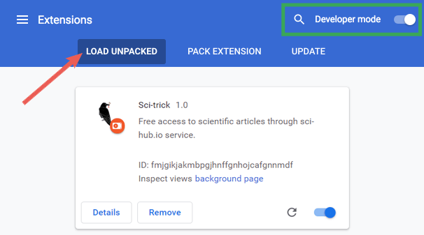

Sci-trick
==========

Chrome extension that appends ".sci-hub.se" to active tab domain, allowing free access to scientific articles.

The hard work is done by [Sci-Hub].

## Installation

You can load it as an unpacked extension in developer mode on Chrome. Follow this instructions:

1. download and unzip this repo: `https://github.com/hamdiBh/sci-trick/archive/master.zip`. Take note where you unzipped it.
2. Open Chrome and access `chrome://extensions`, or just open the menu -> settings -> extensions.
3. Check the developer mode in upper right.
   
4. Click "Load unpacked extension" button
5. Select the folder into which you unzipped **Sci-trick** and click "Open".
6. We're done. The extension should be available as if installed from Chrome store.

[Sci-Hub]:http://sci-hub.bz
